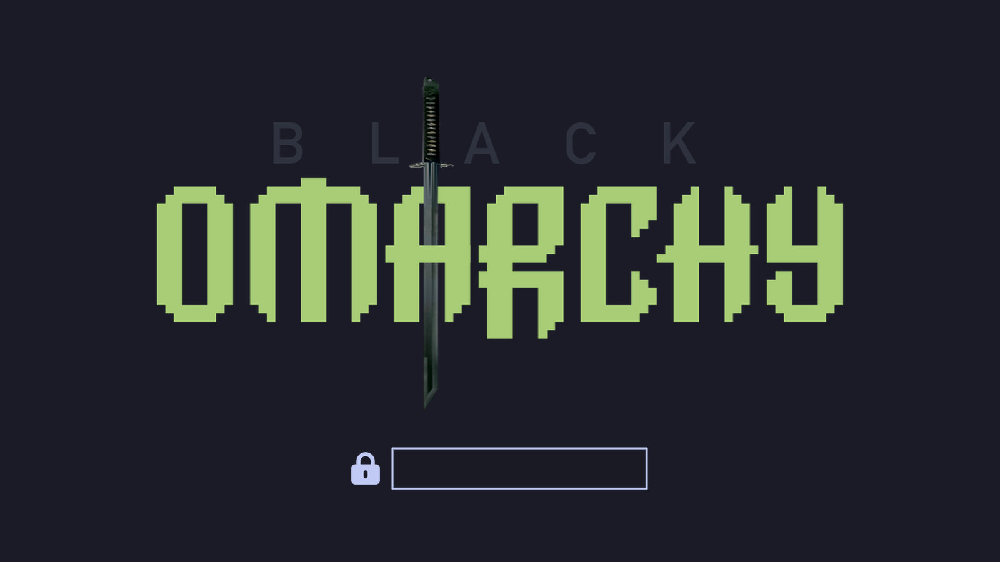

# Black omARCHy



An additive BlackArch layer for [Omarchy](https://omarchy.org).

**Project site:** [mahdihedhli.github.io/BlackOmarchy](https://mahdihedhli.github.io/BlackOmarchy/)

It is a bootstrap, a small CLI, and a set of package lists that have to
earn their place on an Omarchy host. It is not a Linux distribution, not
an ISO, and not a restyle of Omarchy.

After a successful install you should still have the same Omarchy
desktop, applications, keybindings, and update command. You also have
the official BlackArch repository and a curated tool set.

v0.1 is experimental. Treat it that way.

## What this is not

- Not affiliated with, endorsed by, or part of Omarchy, BlackArch, or
  Arch Linux.
- Not a fork of Omarchy and not a "hardened Omarchy".
- Not an installer for the complete BlackArch package group.
- Not a one-line `curl | sudo bash` product.

If a BlackArch package would change Omarchy, that package is excluded.

## Relationship to upstream projects

| Project | Role |
| --- | --- |
| [Omarchy](https://omarchy.org) | The desktop and the supported Arch-based host. Owned by its authors. |
| [Arch Linux](https://archlinux.org) | The package manager and base that Omarchy already uses. |
| [BlackArch](https://blackarch.org) | The unofficial Arch user repository of security tools. |

Black omARCHy only adds the official BlackArch repository, required
signing material, curated packages, and its own CLI and state files.

## Prerequisites

- A clean, supported Omarchy 4.x install (packaged `omarchy`, not
  `omarchy-dev`)
- `x86_64`
- Root via `sudo`
- Network access to `blackarch.org` and `www.blackarch.org`

## Installation

Copy the repository to the Omarchy machine, read `bootstrap.sh`, then
run it.

```bash
git clone https://github.com/MahdiHedhli/BlackOmarchy.git
cd BlackOmarchy
less bootstrap.sh
sudo ./bootstrap.sh
```

The script:

1. Checks architecture and Omarchy evidence
2. Backs up pacman configuration
3. Records an Omarchy baseline
4. Downloads official `strap.sh` and checks it against the SHA1
   currently published on the BlackArch downloads page
5. Verifies the BlackArch keyring tarball with the fingerprint named in
   that script
6. Runs the verified strap script if the BlackArch repo is not already
   enabled
7. Installs the `core` profile one package at a time, skipping anything
   that would upgrade or replace already-installed software
8. Installs the `blackomarchy` CLI, Omarchy menu overlay, login
   wordmark, update hooks, and Agent Skills
9. Compares the Omarchy baseline and exits non-zero on unexpected drift

Re-running bootstrap is safe. It will not duplicate `[blackarch]` or
re-run `strap.sh` when the repo is already enabled. Re-run it after
pulling this repo to refresh CLI, hooks, login overlay, and skills.

After install, Omarchy's menu grows additive entries (no upstream files
are patched):

- Install > Black omARCHy
- Remove > Black omARCHy
- Install > Security tools (extra profiles)
- Security (status, verify, and a few installed tools)

Install and Remove use the same floating terminal Omarchy uses for
Chrome, 1Password, and other optional apps. After the first bootstrap,
add/remove is that menu path. Uninstall keeps the Install row so
re-add is the same gesture.

The SDDM login screen keeps Omarchy's greeter and colors. Bootstrap
overlays `logo.png` only: a quiet BLACK caption above the pixel
OMARCHY wordmark, with the BlackArch katana through the A. Uninstall
restores Omarchy's logo. `omarchy update` re-applies the overlay if
the packaged greeter overwrote it.

## Agent skills

Bootstrap installs two standard Agent Skills (`SKILL.md` folders), not
Grok-only:

| Skill | Role |
| --- | --- |
| `black-omarchy` | This host: CLI, profiles, `omarchy update`, Omarchy invariants |
| `black-omarchy-pentest` | Authorized collaborative / semi-autonomous testing |

They land in the directories common agents already scan (`~/.agents/skills`,
`~/.grok/skills`, `~/.claude/skills`, `~/.cursor/skills`, `~/.codex/skills`,
OpenCode, Gemini). A clone of this repo also has `.agents/skills/` plus
[AGENTS.md](AGENTS.md) / [CLAUDE.md](CLAUDE.md).

`black-omarchy-pentest` will not scan until authorization and scope are
on record. It will not generate exploit source. Details:
[docs/agent-skills.md](docs/agent-skills.md).

## Updating

Keep using Omarchy's update command. There is no separate Black omARCHy
updater.

```bash
omarchy update
```

That path is `pacman -Syu` with Omarchy's snapshot and migrations.
With `[blackarch]` still in `pacman.conf`, BlackArch packages update in
the same transaction as the rest of the system. Do not replace this
with a raw `pacman -Syu`.

Omarchy can rewrite `pacman.conf` from a channel template
(`omarchy refresh pacman`, some migrations). That is the step that
would otherwise drop `[blackarch]`. Black omARCHy installs the
documented user hooks so the stanza is restored automatically:

- `~/.config/omarchy/hooks/pre-refresh-pacman.d/blackomarchy-blackarch.sh`
  runs after the template is copied and before `pacman -Syyuu`
- `~/.config/omarchy/hooks/post-update.d/blackomarchy-post-update.sh`
  runs at the end of `omarchy update`: re-appends `[blackarch]` if
  needed, re-applies the login overlay, and refreshes the Omarchy
  baseline pin so `blackomarchy verify` does not treat a successful
  Omarchy upgrade as layer drift

In both cases `[blackarch]` is appended last, so core/extra/omarchy
keep package-name priority. The layer is not a fork and does not
replace Omarchy's update binary.

`omarchy update` does **not** git-pull this repo. To pick up new
skills, hooks, or the login wordmark, pull and re-run
`sudo ./bootstrap.sh` (or Install > Black omARCHy). That is
idempotent.

## Package profiles

Default install is `core` only.

```bash
blackomarchy profiles
sudo blackomarchy install web
sudo blackomarchy install recon
sudo blackomarchy install network
sudo blackomarchy install wireless
sudo blackomarchy install reversing
sudo blackomarchy install forensics
sudo blackomarchy install password
sudo blackomarchy install all
```

`all` means every Black omARCHy curated profile. It does not mean every
BlackArch package.

See [docs/package-profiles.md](docs/package-profiles.md) and
[docs/compatibility.md](docs/compatibility.md).

## Verification

```bash
blackomarchy status
blackomarchy verify
blackomarchy doctor
```

`verify` fails if Omarchy-owned files, the Omarchy repo line, or Omarchy
packages drifted.

## Uninstall

```bash
sudo ./uninstall.sh
```

Details: [docs/uninstall.md](docs/uninstall.md).

## Security model

- No `curl | sh`.
- `strap.sh` is hash-checked against the live official downloads page.
- The keyring tarball is signature-checked before `strap.sh` is allowed
  to install it.
- Bootstrap never sets `OMARCHY_ALLOW_DIRECT_PACMAN`.
- Conflicts are skipped, not overwritten.
- Local operator files live in `private/` and are gitignored.

The downloads-page SHA1 is same-origin with `strap.sh`. It catches
corruption and split-brain, not a compromise of blackarch.org itself.

## Known limitations

- x86_64 and packaged Omarchy 4.x only (checked on 4.0.1 and 4.0.2)
- `omarchy-dev` is refused
- Some profile candidates will be missing or excluded on a given host
- BlackArch tools that share a name with Arch `extra` keep the
  Omarchy/Arch version because `[blackarch]` is appended last
- v0.1 does not add Hyprland themes or keybindings; the menu, login
  wordmark, and Agent Skills are overlays and uninstall cleanly
- `hydra` pulls a large extra dependency set (including freerdp and
  subversion). That did not upgrade Omarchy's own packages.
- `omarchy update -y` over a non-interactive SSH session may still hit
  a nested sudo prompt. The Omarchy system-package updater
  (`omarchy-update-system-pkgs`) completed with BlackArch enabled.

## Contributing

Read `.specify/memory/constitution.md` and
`specs/001-black-omarchy-bootstrap/spec.md` before proposing changes.
The design test is: does Black omARCHy require this, or are we trying
to make Omarchy look like a security distribution?

## Disclaimer

Black omARCHy is an independent integration project. Omarchy, BlackArch,
and Arch Linux names are used for identification only. Security tools
can be misused; you are responsible for how you use them.
